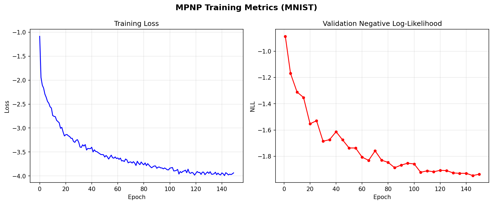

# Final Project — Martingale Posterior Neural Process for MNIST Image Completion

Implementation of the [Martingale Posterior Neural Process](https://arxiv.org/abs/2304.09431) (MPNP, ICLR 2023 — Lee et al.) trained on MNIST for image inpainting. Given a random subset of observed pixels (context), the model predicts all 784 pixel values along with calibrated uncertainty estimates via predictive resampling.

The base Neural Process encoder/decoder architecture in [`neural_process.py`](neural_process.py) is adapted from [EmilienDupont/neural-processes](https://github.com/EmilienDupont/neural-processes). The martingale posterior extension, attention-based pseudo-context generation, and the MPNP loss function are implemented in [`martingale_posterior_neural_process.py`](martingale_posterior_neural_process.py).

## Quick Start

```bash
make
```

Or step by step:

```bash
make preprocess   # download MNIST, print dataset stats, save sample grid
make train        # train MPNP for 150 epochs (use train-quick for 20)
make postprocess  # generate inpainting comparison figures
```

## Results

### Image Completion

Each row is a held-out test image. Columns: original image, observed context pixels, predicted mean ($\mu$), predicted standard deviation ($\sigma$).


The model reconstructs digit structure from sparse context and concentrates uncertainty ($\sigma$) on unobserved regions and ambiguous edges — consistent with the MPNP paper's finding that martingale-consistent posteriors produce better-calibrated uncertainty than standard NP latent variables.

### Training Metrics



## Usage

```bash
uv run train_inpainting.py --epochs 150 --lr 5e-4 --seed 42
uv run postprocess.py --num_context 100 --num_samples 30 --num_images 10
```

## How It Works

The standard Neural Process encodes context points into a latent $z \sim q(\theta \mid \text{context})$ and decodes target predictions from $z$. The MPNP replaces the fixed latent prior with a **predictive resampling** scheme: it generates pseudo-context points from the model's own predictive distribution, then conditions on both real and pseudo context. Under the martingale posterior framework, uncertainty in the generated pseudo-data corresponds to genuine posterior uncertainty, without the need to specify an explicit prior.

The training loss combines three terms:

| Term | Purpose |
| --- | --- |
| $\mathcal{L}_\text{marg}$ | Marginal likelihood via log-mean-exp over $K$ pseudo-samples |
| $\mathcal{L}_\text{amort}$ | Amortisation — context-only likelihood |
| $\mathcal{L}_\text{pseudo}$ | Encourages pseudo-contexts to be predictive of targets |

## References

- H. Lee, E. Yun, G. Nam, E. Fong, J. Lee. **Martingale Posterior Neural Processes.** ICLR 2023. [arXiv:2304.09431](https://arxiv.org/abs/2304.09431)
- E. Dupont. **Neural Processes** (PyTorch). [github.com/EmilienDupont/neural-processes](https://github.com/EmilienDupont/neural-processes) — base NP encoder/decoder code
- M. Garnelo et al. **Neural Processes.** ICML 2018 Workshop. [arXiv:1807.01622](https://arxiv.org/abs/1807.01622)
